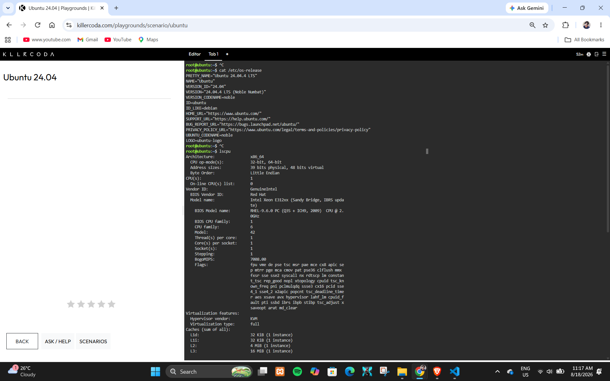
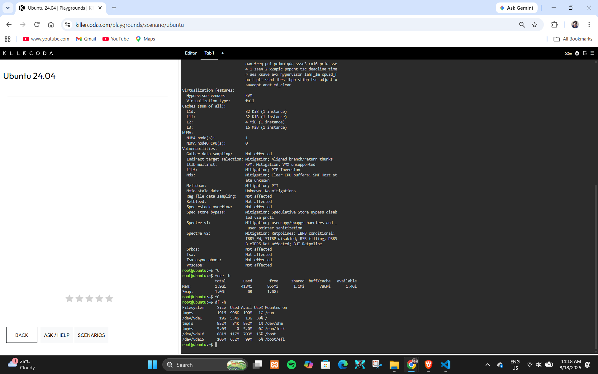

---

# Linux Server Investigation

## KillerCoda Playground

A Linux server was investigated using the KillerCoda Playground. Linux commands were used to identify the operating system, CPU information, memory, and available disk space.

## Operating System

The Linux server is running:

- **Operating System:** Ubuntu 24.04.4 LTS
- **Version:** 24.04
- **Codename:** Noble Numbat

The operating system information was obtained using the `cat /etc/os-release` command.

## CPU Information

The server uses the following CPU configuration:

- **Architecture:** x86_64
- **CPU:** Intel Xeon E312xx (Sandy Bridge, IBRS update)
- **CPU(s):** 1
- **Core(s) per socket:** 1
- **Thread(s) per core:** 1
- **Hypervisor:** KVM

The CPU information was obtained using the `lscpu` command.

## Memory

The server has:

- **Total Memory:** 1.9 GiB
- **Used Memory:** 418 MiB
- **Free Memory:** 865 MiB
- **Available Memory:** 1.4 GiB
- **Swap:** 1.0 GiB

The memory information was obtained using the `free -h` command.

## Disk Space

The main filesystem is:

- **Filesystem:** /dev/vda1
- **Total Size:** 19 GB
- **Used:** 5.4 GB
- **Available:** 13 GB
- **Usage:** 30%
- **Mount Point:** /

The disk information was obtained using the `df -h` command.

## Cloud Hosting Options

If this Linux server were migrated to the cloud, it could be hosted using virtual machine services from AWS, Microsoft Azure, and Google Cloud.

### AWS

The Linux server could be hosted using **Amazon EC2**. EC2 provides configurable virtual machines that can run Linux operating systems. The server could be assigned an instance type with suitable CPU, memory, storage, and networking resources.

### Microsoft Azure

The server could be hosted using **Azure Virtual Machines**. Azure supports Linux virtual machines and allows organizations to select different virtual machine sizes based on workload requirements.

### Google Cloud

The server could be hosted using **Compute Engine**. Compute Engine provides configurable virtual machines that can run Linux operating systems and allows organizations to select appropriate CPU, memory, storage, and networking resources.

## Cloud Service Comparison

| Cloud Provider | Virtual Machine Service | Possible Linux Hosting |
|---|---|---|
| AWS | Amazon EC2 | Linux EC2 instance |
| Microsoft Azure | Azure Virtual Machines | Linux Azure VM |
| Google Cloud | Compute Engine | Linux Compute Engine VM |

## KillerCoda Evidence

### Terminal Screenshot 1

### Terminal Screenshot 2

