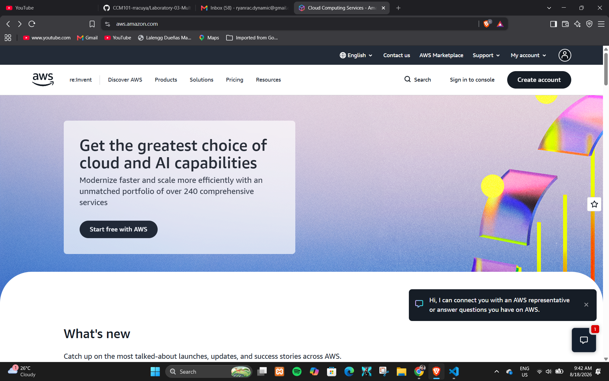

# AWS Research

## 1. Brief Overview

Amazon Web Services (AWS) is a cloud computing platform that provides a wide range of on-demand IT resources and services through the internet. Organizations can use AWS to build, deploy, store, and manage applications and data without having to maintain all of the underlying physical infrastructure themselves. AWS provides services for computing, storage, networking, databases, security, analytics, and many other cloud computing requirements.

## 2. Global Infrastructure

AWS operates a global cloud infrastructure consisting of Regions, Availability Zones, and other infrastructure locations. An AWS Region is a separate geographic area that contains multiple Availability Zones. Availability Zones are isolated locations within a Region that are designed to provide greater availability and fault tolerance for applications.

Organizations can select AWS Regions based on factors such as application requirements, latency, compliance, and data residency. Using multiple Availability Zones can help applications remain available even if an individual location experiences a failure.

## 3. Cloud Management Console

The AWS Management Console is a web-based interface used to access and manage AWS services. Through the console, users can create and configure cloud resources, monitor services, manage security settings, and view account information.

The console provides a graphical interface that allows cloud administrators and developers to manage AWS resources without having to perform every operation through command-line tools.

## 4. Four Core Services

### Amazon EC2

Amazon Elastic Compute Cloud (Amazon EC2) provides resizable computing capacity in the AWS cloud. It allows organizations to launch virtual servers, called instances, and configure them according to their computing requirements.

### Amazon S3

Amazon Simple Storage Service (Amazon S3) is an object storage service designed to store and retrieve data. It can be used for files, backups, application data, media, and other types of objects.

### Amazon VPC

Amazon Virtual Private Cloud (Amazon VPC) allows users to create a logically isolated virtual network within AWS. It provides networking features such as subnets, routing, security controls, and connectivity for AWS resources.

### AWS IAM

AWS Identity and Access Management (IAM) helps organizations control access to AWS resources. It allows administrators to manage identities and permissions so that users and applications receive only the access they require.

## 5. Three Advantages

### 1. Broad Service Selection

AWS provides a large selection of cloud services covering computing, storage, networking, databases, security, analytics, artificial intelligence, and other IT requirements.

### 2. Global Infrastructure

AWS provides infrastructure across many geographic locations, allowing organizations to deploy applications closer to their users and design systems for high availability and resilience.

### 3. Scalability and Flexibility

AWS allows organizations to increase or decrease cloud resources according to their requirements. This makes it suitable for applications with changing workloads and growing business needs.

## 6. Typical Enterprise Use Cases

Enterprises use AWS for many different workloads. Common examples include hosting websites and business applications, storing and backing up data, running databases, building scalable application infrastructure, disaster recovery, data analytics, and artificial intelligence and machine learning workloads.

AWS can also be used by organizations that need globally distributed infrastructure and highly available applications.

## AWS Screenshot Evidence

