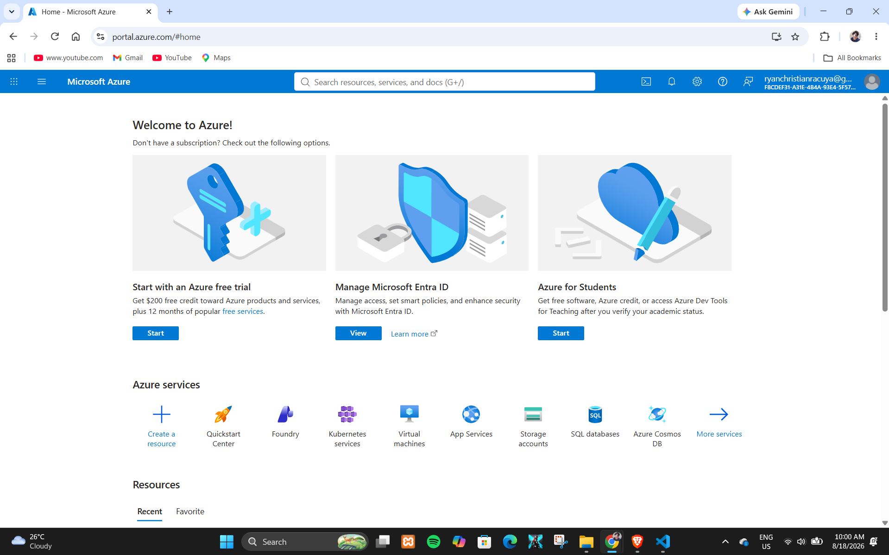

# Microsoft Azure Research

## 1. Brief Overview

Microsoft Azure is a cloud computing platform provided by Microsoft. It offers a wide range of cloud services that organizations can use to build, deploy, manage, and scale applications and IT infrastructure. Azure provides services for computing, storage, networking, databases, security, analytics, artificial intelligence, and many other enterprise requirements.

Azure supports organizations in moving workloads from traditional data centers to cloud environments and in building new cloud-native applications.

## 2. Global Infrastructure

Microsoft Azure operates a global cloud infrastructure organized into geographic regions and data center locations. Azure Regions contain cloud resources and services that customers can use to deploy their applications and workloads.

Azure also provides availability and redundancy features that allow organizations to design applications that can continue operating when infrastructure components experience failures. Organizations can select locations based on factors such as latency, compliance, data residency, and business requirements.

## 3. Cloud Management Console

The Microsoft Azure portal is a web-based management interface used to create, configure, monitor, and manage Azure resources and services. Administrators and developers can use the portal to manage virtual machines, storage, networking, databases, identities, security settings, and other cloud resources.

The portal provides a graphical interface for managing Azure services and can be used together with other management tools such as Azure CLI and Azure PowerShell.

## 4. Four Core Services

### Azure Virtual Machines

Azure Virtual Machines provide scalable computing resources that allow organizations to run Windows or Linux operating systems in the cloud. They can be configured with different computing, memory, storage, and networking options depending on workload requirements.

### Azure Blob Storage

Azure Blob Storage is Microsoft's object storage service for storing large amounts of unstructured data. It can be used for documents, images, videos, backups, logs, and application data.

### Azure Virtual Network

Azure Virtual Network provides private networking capabilities for Azure resources. It allows organizations to create virtual networks, subnets, routing configurations, and network security controls for their cloud workloads.

### Microsoft Entra ID

Microsoft Entra ID is Microsoft's cloud-based identity and access management service. It helps organizations manage identities and control access to applications, services, and resources.

## 5. Three Advantages

### 1. Microsoft Ecosystem Integration

Azure provides strong integration with Microsoft technologies and services, including Windows Server, Microsoft 365, Active Directory-related technologies, and other enterprise Microsoft solutions.

### 2. Enterprise Capabilities

Azure provides a broad range of services for enterprise computing, databases, networking, security, analytics, and application development.

### 3. Hybrid Cloud Support

Azure supports hybrid cloud environments, allowing organizations to connect and manage on-premises infrastructure together with cloud resources. This can be useful for organizations that need to gradually migrate existing systems to the cloud.

## 6. Typical Enterprise Use Cases

Organizations use Azure for many enterprise workloads, including Windows Server applications, virtual machines, databases, web applications, identity management, data analytics, backup and disaster recovery, hybrid cloud environments, and artificial intelligence applications.

Azure is also commonly used by organizations that already rely on Microsoft technologies and want to extend their existing infrastructure into the cloud.

## Azure Screenshot Evidence

