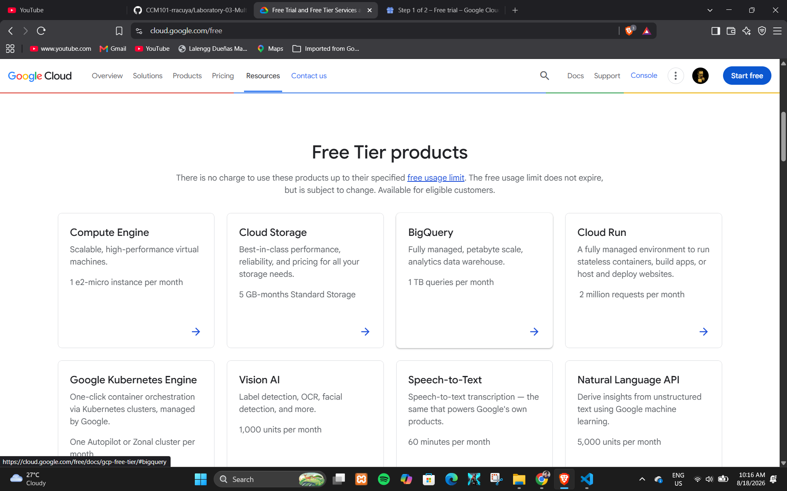

# Google Cloud Platform (GCP) Research

## 1. Brief Overview

Google Cloud is a public cloud computing platform provided by Google. It provides cloud services that organizations can use to build, deploy, operate, and scale applications and infrastructure. Google Cloud offers services for computing, storage, networking, databases, security, analytics, artificial intelligence, machine learning, and application development.

Google Cloud also provides technologies and services that support cloud-native applications, data-intensive workloads, and modern software development.

## 2. Global Infrastructure

Google Cloud operates a global infrastructure consisting of geographic regions and zones. A Google Cloud region is a specific geographic location where cloud resources can be deployed, while zones are locations within a region that provide isolated infrastructure for workloads.

Organizations can select regions and zones based on requirements such as latency, availability, data residency, and application architecture. Deploying workloads across multiple zones can help improve availability and resilience.

## 3. Cloud Management Console

The Google Cloud console is a web-based management interface used to access and manage Google Cloud resources and services. Users can use the console to create projects, configure cloud resources, monitor workloads, manage identities, and control security and billing settings.

The Google Cloud console provides a graphical interface and can be used together with tools such as the Google Cloud CLI for managing cloud resources.

## 4. Four Core Services

### Compute Engine

Compute Engine provides configurable virtual machines that run on Google's infrastructure. Organizations can use virtual machines to host applications, services, and workloads that require control over the operating system and computing environment.

### Cloud Storage

Cloud Storage is Google's object storage service. It allows organizations to store and retrieve different types of data such as application files, backups, media, and other unstructured data.

### Virtual Private Cloud

Google Cloud Virtual Private Cloud (VPC) provides networking capabilities for Google Cloud resources. It allows organizations to configure networks, subnets, routes, firewall rules, and other networking components.

### Cloud Identity and Access Management

Google Cloud Identity and Access Management (IAM) allows organizations to control access to cloud resources. Administrators can assign roles and permissions to users, groups, and service accounts based on their responsibilities.

## 5. Three Advantages

### 1. Artificial Intelligence and Machine Learning

Google Cloud provides a strong collection of artificial intelligence and machine learning technologies. Its cloud platform supports organizations developing, training, deploying, and managing AI and ML applications.

### 2. Data and Analytics Capabilities

Google Cloud provides services for large-scale data processing, analytics, and data management. These capabilities are useful for organizations that work with large amounts of data.

### 3. Cloud-Native and Kubernetes Technologies

Google Cloud has strong capabilities for containerized and cloud-native applications. Google Kubernetes Engine (GKE) provides a managed Kubernetes environment for deploying and managing containerized workloads.

## 6. Typical Enterprise Use Cases

Organizations use Google Cloud for web and application hosting, data analytics, artificial intelligence and machine learning, containerized applications, Kubernetes deployments, databases, storage, and large-scale data processing.

Google Cloud is particularly useful for organizations that need advanced data analytics, AI and ML capabilities, and cloud-native application infrastructure.

## GCP Screenshot Evidence

